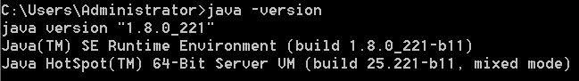
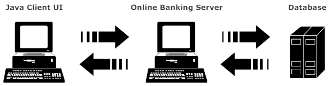

# 
  Java Programming

 Xiang Zhang 

 javaseu@163.com

## Preparing the Environment

- Installing JDK 8+ (J2SE version 8 or above) into your computer: [https://www.oracle.com/java/technologies/downloads/](https://www.oracle.com/java/technologies/downloads/);
- Verifying if JDK has been succesfully installed by typing "java -version" in your comannd line like this. If you see "java version "1.x.xxxxx"", congradulations!

  

- Then installs Eclipse IDE for J2SE ([https://www.eclipse.org](https://www.eclipse.org))(the latest version is 2019-06, "Eclipse IDE for Java Developers", please DO NOT download the "Eclipse IDE for Enterprise Java Developers", that is for J2EE, which is another edition of Java)  OR IntelliJ IDEA ([https://www.jetbrains.com/idea/](https://www.jetbrains.com/idea/)). 
- Verifying if the IDE is correctly installed by running a HelloWorld program, taking Eclipse as the example: [example](./example.html)
	

## Java Style

- Google Java Style: [https://google.github.io/styleguide/javaguide.html](https://google.github.io/styleguide/javaguide.html)
	- Eclipse Code Style Formatter: [eclipse-java-google-style.xml](./formatter/eclipse-java-google-style.xml "eclipse-java-google-style.xml")
	- Intellij Code Style Formatter: [intellij-java-google-style.xml](./formatter/intellij-java-google-style.xml "intellij-java-google-style.xml")
- Eclipse Checkstyle Plugin: [http://eclipse-cs.sourceforge.net/#!/](http://eclipse-cs.sourceforge.net/#!/)

	
> Checkstyle is a Open Source development tool to help you ensure that your Java code adheres to a set of coding standards. Checkstyle does this by inspecting your Java source code and pointing out items that deviate from a defined set of coding rules.

## Searchable Javadoc

[CHM version of Javadoc for JDK8](./resource/JDK8API.chm)

## Slides

- L00 [Introduction](./slides/L00_Introduction.pdf)
- L01 [Java Fundamentals](./slides/L01_Java_Fundamentals.pdf)
- L02-1 [Java Object-oriented Programming I: Classes and Objects](./slides/L02_1_Java_OO_I.pdf)
- L02-2 [Java Object-oriented Programming II: Abstraction, Inheritance and Polymorphism](./slides/L02_2_Java_OO_II.pdf)
- L03 [Java Exception](./slides/L03_Java_Exception.pdf)
- L04 [Java IO](./slides/L04_Java_IO.pdf)
- L05 [Java Collection](./slides/L05_Java_Collection.pdf)
- L08 [Java Multi-Thread](./slides/L08_Java_Multi_Thread.pdf)
- L10 [Java and Database](./slides/L10_JDBC.pdf)
- L11 [Java Network Programming](./slides/L11_Java_Network_Programming.pdf)

<!--
- L10 [Java and Database](./slides/L10_JDBC.pdf)
- L11 [Java Network Programming](./slides/L11_Java_Network_Programming.pdf)
- About Exam [Exam](./slides/exam.pdf)

- L06 [Java Generic Type](./slides/L06_Java_Generic_Type.pdf) (not included in the exam)
- L07 [Java User Interface](./slides/L07_Java_and_User_Interface.pdf) (not included in the exam)
- L08 [Java Multi-Thread](./slides/L08_Java_Multi_Thread.pdf)
- L09 [Java and XML](./slides/L09_Java_and_XML.pdf) (not included in the exam)
- L10 [Java and Database](./slides/L10_JDBC.pdf) (not included in the exam)
- L11 [Java Network Programming](./slides/L11_Java_Network_Programming.pdf)
-->

## Assignments

All the assignments must be submitted to javaseu@163.com 
**Soft Deadline**: submit your code before the next weekend.  
**Hard Deadline**: submit all your assignements before the examination week.  
Please pay attention:  
For Chinese class, the title of your email should be: 中文班 + 学号 + 姓名 + 章节，for example: "中文班 71120101 张祥 第五章作业" 
For English class, the title of your email should be: 英文班 + 学号 + 姓名 + 章节，for example: "英文班 71120101 张祥 第五章作业"

- L04 [Java IO](./assignments/L04.pdf) (*第一题d选项选做，第二题选做) 
- L05 [Java Collection](./assignments/L05.pdf) (*第一题不用做) 
- L08 [Java Multi-Thread](./assignments/L08.pdf)
- L10 [JDBC](./assignments/L10.pdf)
- L11 [Java Network Programming](./assignments/L11.pdf) 
<!--
- L08 [Java Multi-Thread](./assignments/L08.pdf) (*第一题不用做) 
- L11 [Java Network Programming](./assignments/L11.pdf) 
-->

## Course Design

构造一个ATM机，允许存在多个账户，且向用户提供两层菜单：
第一层菜单为用户登录菜单，包括以下两个功能：

1. create new user (创建新用户)
2. login (用户登录)
3. exit (退出ATM机)

用户登录后进入第二层菜单，包括以下五个功能：

1. change password (修改密码)
2. query (查询余额)
3. withdraw (取钱)
4. deposit (存钱)
5. logout (用户登出，回到一级菜单)

课程设计要求：

- 一个用户的基本信息包括：用户名、密码、账户余额 等等；
- 用户的信息需要能够保存在文件中，下一次启动ATM机请将已保存的用户信息读取出来；
- * 每过10秒钟，ATM机为每位用户增加5%的利息(选做)(退出ATM机后不用再加利息)；
- 除了代码以外，还需提交一份简短的课程设计报告（1-2页），阐述自己代码的架构（例如是否采用MVC架构）、利息的计算方法、设计中碰到的问题等等。在课程设计报告中，也鼓励大家写一些对本次课程的看法和建议，会有相应的加分；
- 最终将源码+电子版课程设计报告发送至 javaseu@163.com，邮件标题为：学号+姓名+“课程设计” ，切勿忘填学号和姓名
- 纸质版课程设计报告需要提交，请提交给课程助教钱依宁同学 
- 课程设计报告封面： 
- 截止时间：第12周周日晚24点 

<!--
- L04 [Java IO](./assignments/L04.pdf)
- L05 [Java Collection](./assignments/L05.pdf)
- L07 [Java UI](./assignments/L07.pdf)
- L08 [Java Multi-thread](./assignments/L08.pdf)
- L10 [Java and Database](./assignments/L10.pdf) 
- L11 [Java Network Programming](./assignments/L11.pdf)
-->

<!--
## Flipped Classroom

### Java Language

- 1. Java New Features  | Java新特性（从Java8至今）
- 2. Java Generic Type | Java泛型 
- 3. Java and Swing/SWT | Java和Swing/SWT 
- 4. Java Garbage Collection Algorithms | Java垃圾回收算法 
- 5. Java Reflection | Java反射机制 

### Java Project Development

- 6. Java Code Style and Javadoc  | Java代码规范和Javadoc 
- 7. Java Unit Test  | Java单元测试 
- 8. Debugging in Eclipse/IDEA  | 在Eclipse或IDEA中调试错误 
- 9. Maven: Java Project Management  | 使用Maven管理Java项目 
- 10. Github: Where People Build Software | Github：代码托管平台 
- 11. Java Profiling Tools | Java性能测试工具 ：

### Java and Data Processing

- 12. Handling XML/JSON/HTML in Java  | 通过Java对XML/JSON/HTML等进行数据处理 
- 13. Java Encoding/Decoding | Java多语言编码和解码 | 报告人： 报告时间：
- 14. Java Text Searching With Lucene/ElasticSearch | Java文本搜索 - Lucene/ElasticSearch 
- 15. Java and Graph Database | Java与图数据库 
- 16. Java Data Encryption and Decryption | Java数据加密与解密 
- 17. Java Data Compression and Decompression | Java数据压缩和解压缩 
- 18. Java and MapReduce | Java和MapReduce 

### Java and Design Pattern

- 19. Code Bad Smell | 代码异味 
- 20. Java Design Pattern : Using *Factory* Pattern as Example | Java设计模式：以工厂模式为例 

## Video Lectures

- [Java-W1-1](https://meeting.tencent.com/v2/cloud-record/share?id=23c6c323-60c9-4d0b-9d35-9494ef5a6c90&from=3 "") pass:TKvzol3s
- [Java-W2-1](https://meeting.tencent.com/v2/cloud-record/share?id=687951cc-b603-4c7f-9da9-27f4cffe1c02&from=3 "") pass:F2piXa66
- [Java-W2-2](https://meeting.tencent.com/v2/cloud-record/share?id=25cc2445-3801-4ca8-bab2-536c7b0d34fb&from=3 "") pass:DzvZg1sW
- [Java-W3-1](https://meeting.tencent.com/v2/cloud-record/share?id=6b29a549-d091-4eb3-8140-a2b1559db816&from=3 "") pass:U0NJt722
- [Java-W4-1](https://meeting.tencent.com/v2/cloud-record/share?id=5512a831-5038-47bb-b851-287757ca0b01&from=3 "") pass:8vYnfOP2
- [Java-W4-2](https://meeting.tencent.com/v2/cloud-record/share?id=9980c2cf-b191-4190-89d1-e6f02a8f966f&from=3 "") pass:T1J7g9X6
- [Java-W5-1](https://meeting.tencent.com/v2/cloud-record/share?id=f4d7774f-2964-4a6c-8c47-a049d19c27f2&from=3 "") pass:X99b
- [Java-W5-2](https://meeting.tencent.com/v2/cloud-record/share?id=3dd4f04a-82e0-4757-8d81-1d9631e2683c&from=3 "") pass:yFQn
- [Java-W7-1](https://meeting.tencent.com/v2/cloud-record/share?id=b4b6bcf0-59df-4b24-8eaa-9ec9c670e1e4&from=3"") pass:fg8k
- [Java-W7-2](https://meeting.tencent.com/v2/cloud-record/share?id=34d79d72-05f2-4988-b96d-a306f52d224e&from=3"") pass:aV8w
- [Java-W8-1](https://meeting.tencent.com/v2/cloud-record/share?id=dfc9e7fc-a5a4-445c-953e-3134279582ea&from=3"") pass:ZUGW
- [Java-W8-2](https://meeting.tencent.com/v2/cloud-record/share?id=97d9e377-e54b-4142-bc76-ed3a826a62a4&from=3"") pass:Pvf8
- [Java-W9-2](https://meeting.tencent.com/v2/cloud-record/share?id=7cd53d45-6618-49bb-b269-ac4694df74c2&from=3"") pass:2H4g
- [Java-W10-1](https://meeting.tencent.com/v2/cloud-record/share?id=08bccb3c-5b4b-41a3-aeb1-2c39a5afe02a&from=3"") pass:Vud7
- [Java-W10-2](https://meeting.tencent.com/v2/cloud-record/share?id=4b54db6a-851a-4958-afdb-3d9a584707cb&from=3"") pass:Jy2J
- [Java-W11-1](https://meeting.tencent.com/v2/cloud-record/share?id=6660d6d7-31a8-465f-a24a-b24dfeeb7fab&from=3"") pass:QSV6
- [Java-W11-2](https://meeting.tencent.com/v2/cloud-record/share?id=cddb81b0-2ed4-48d8-976a-bcff22c20fbe&from=3"") pass:cD5s
- [Java-W12-1](https://meeting.tencent.com/v2/cloud-record/share?id=a54ec768-b6a5-48dd-b88c-68c32f117ff8&from=3"") pass:7HeH
- [Java-W13-1](https://meeting.tencent.com/v2/cloud-record/share?id=1c42534f-0c09-4a40-bf70-3f0877597753&from=3"") pass:axFq
- [Java-W13-2](https://meeting.tencent.com/v2/cloud-record/share?id=1846ce02-9401-4e04-8047-3d5c40b00354&from=3"") pass:Ejaz
- [Java-W14-1](https://meeting.tencent.com/v2/cloud-record/share?id=8c1c8f8f-ac7e-4465-8296-15db5263a3eb&from=3"") pass:D2zs
- [Java-W14-2](https://meeting.tencent.com/v2/cloud-record/share?id=8d157768-b274-4eff-9760-26f850943119&from=3"") pass:ZXrU
- [Java-W15-1](https://meeting.tencent.com/v2/cloud-record/share?id=85d46b19-8693-4cf1-8d44-5792d5eecc04&from=3"") pass:bSMM
- [Java-W15-2](https://meeting.tencent.com/v2/cloud-record/share?id=c4a42639-f8cf-45e5-b092-5884d14ab5c2&from=3"") pass:xfzr
- [Java-W16-1](https://meeting.tencent.com/v2/cloud-record/share?id=2d6ca0fd-9960-4d70-a1cb-c1350ad18cbd&from=3"") pass:M2cJ
- [Java-W16-2](https://meeting.tencent.com/v2/cloud-record/share?id=e4426a33-716a-4a03-8370-356d03b21abb&from=3"") pass:8AzH

## Course Design (Not Mandatory)

> **Online banking** is an electronic payment system that enables customers of a financial institution to conduct financial transactions on a website operated by the institution, such as a retail bank, virtual bank, credit union or building society. Online banking is also referred as Internet banking, e-banking, virtual banking and by other terms. [Wikipedia](http://en.wikipedia.org/wiki/Online_banking)

A simulated online banking system is a client-server-database system, which enable users remotely (from a java client, with Swing or console UI) perform banking actions (on online banking server), such as deposit, withdrawl, query balance, loan (贷款) and repay (还款), and all the information should be stored in a database. The following image indicates the process of the simulated online banking system.

  

### About User Account

There are two accounts for each user:

- Checking Account (similar to the notion of “活期存款”) (IR:0.15%)
- Saving Account (similar to the notion of "定期存款"), in which there could be three saving periods:
	- half-year (IR:2.0%)
	- one-year (IR:3.0%)
	- five-year (IR:4.5%) 

Users can deposit to their checking account or saving account with any possible saving period. "IR" refers to The Interest Rate of different deposit. 

### About Deposit and Withdrawl

User is allowed to deposit multiple items in saving account, for example, a $100 for a half-year deposit and another $200 for a one-year deposit. 

The amount of money that a user can withdrawl is no more than balance in his checking account. User may also transfer an item in his saving account to his checking account to increase the balance, which will meanwhile cause the loss of interest in a saving period.  

### About Loan and Repay

Users can apply for a loan. The Bank can approve or reject the loan application according to certain rules. And a loan must be paid off within 10 years, which means the annual payment is 10% of loan plus interest. Loan interest rate is 5%. 

Loan Rules:

- A user can apply for a loan only if there is more than 3 transactions (deposit, withdrawl or query) in the last year, which indicates that the user is still active;
- If eligible for a loan, a user can only apply for a loan not more than the highest total balance in his account (checking plus saving account);
- A user with loan must repay his loan annually with a minimum payment of 10% of loan plus interest. If the user doesn't repay in time, or the payment is less than the minimum, an automatic deduction will be perform on the balance of his accounts (first on checking account, then on saving account). In the case that the balance is not enough for annually payment,  both accounts will be freezed, and no further transaction (deposit, withdrawl or query) is allowed until the loan is entirely paid off.     

### Functions:

- A client-server mode should be used in this system;
- This system is a multi-user system;
- Multiple users are allowed to access the system at the same time; 
- A server daemon should response to concurrent user requests in a multi-thread manner;
- To login into the system, users have to provide their usernames and passwords,and the password should be safely stored;
- All information should stored in a database, which can be access by online banking server;

### Advanced Functions:

- A client UI based on Swing or other API;
- A statistical UI for the bank (on the server side, presenting the number of registed users, total deposit, total loans, etc);
- Encrypted data communication;
- Encoding information with UTF-8, which allows the usage of Chinese characters; 
- Any feature you can imagine! 

-->
